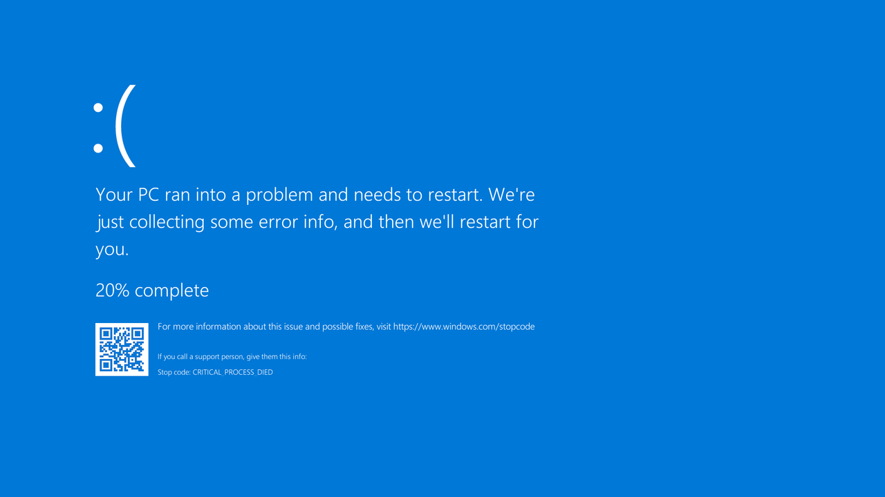

#   BSOD
Force a Blue Screen of Death on Windows 10 / 11
(note that the error code will not be the one from the image but 0xB50DB50D - 0xBSODBSOD)

## Dependencies:
**(only if you run the .py script - you dont need anything installed for the exe)**
- **python** `Python 2.5+` `([Get Python](https://www.python.org/downloads/))`
- **ctypes** `cTypes is included in Python 2.5+`
  
## Danger?:
- No. Even though BSoDs are often associated with harm to files are the OS this one is harmless
